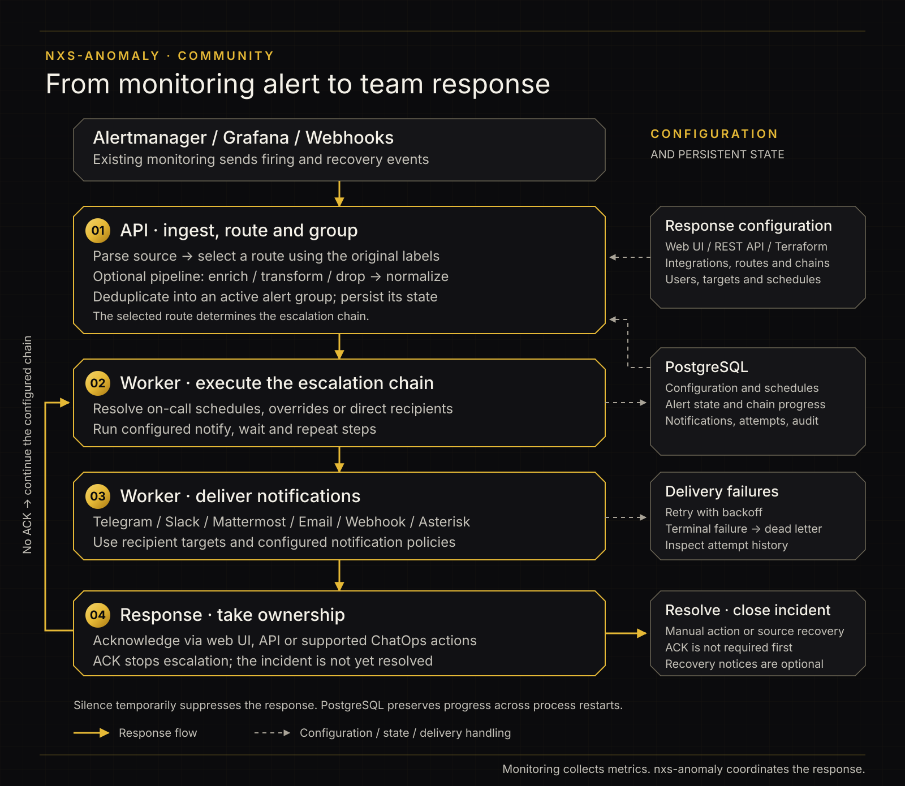

# nxs-anomaly

[](https://github.com/nixys/nxs-anomaly/releases)
[](https://artifacthub.io/packages/helm/nxs-anomaly/nxs-anomaly)
[](https://registry.terraform.io/providers/nixys/nxs-anomaly/latest)


**Turn monitoring alerts into an on-call response — in your own infrastructure.**

nxs-anomaly receives alerts from Prometheus Alertmanager, Grafana and webhooks,
groups repeated events, routes them to the person on call, and escalates until
someone acknowledges. Your team gets a shared alert timeline and a record of
notification attempts, acknowledgements and resolutions.

The backend is a Go binary with PostgreSQL; the web interface ships separately.
Community needs no message broker or cache and is released under Apache 2.0.
Maintained by [Nixys](https://nixys.io/), with community contributions welcome.

## Table of Contents

- [Introduction](#introduction)
- [Quickstart](#quickstart)
- [Documentation](#documentation)
  - [First notification](#get-your-first-notification)
  - [Terraform](#configure-with-terraform)
  - [Troubleshooting](#troubleshooting)
- [Roadmap](#roadmap)
- [Feedback](#feedback)
- [Contributing](#contributing)
- [License](#license)


## Introduction

### Features

| What your team needs | What Community provides |
|---|---|
| Bring existing monitoring together | Ingestion from Prometheus Alertmanager, Grafana and generic JSON webhooks |
| Keep repeated events together | Deduplication and grouping by alert keys, with routing to escalation chains |
| Reach the current duty engineer | On-call rotations, timezones, schedule overrides and team-based escalation steps |
| Escalate an unanswered alert | Notification and wait steps, delivery retries and a dead-letter notification path |
| Use the channels your team already checks | Webhooks, Telegram, email, Slack/Mattermost-compatible endpoints and Asterisk calls |
| Act on an alert | Acknowledge, resolve and silence in the web interface; ChatOps actions where configured |
| Understand what happened | Alert timelines, audit history and delivery attempts |
| Operate the service yourself | Password sign-in, role-based access, REST API, Prometheus metrics, OpenTelemetry tracing and a production security profile |

The interface is available in English and Russian, with per-user language and timezone preferences.

#### Community Edition vs Enterprise Edition

**Community includes the core alerting and on-call workflow under Apache 2.0.**
Use it when the people operating an installation can share visibility and you
manage authentication locally. Teams and role-based permissions are included;
team membership in Community does not create an access boundary.

**Enterprise adds controls for running a shared service across an organization.**

| Capability | Community | Enterprise |
|---|---|---|
| Alert ingestion, grouping, routing and escalation | Included | Included |
| Teams, on-call schedules and notification channels | Included | Included |
| Password sign-in and role-based permissions | Included | Included |
| Audit history, REST API, Prometheus metrics and tracing | Included | Included |
| Self-hosted deployment with PostgreSQL | Included | Included |
| Corporate single sign-on through OIDC | — | Included; configure your identity provider |
| Access scoping by team | — | Included; enable and configure team scoping |
| Lifecycle event stream for external analytics | — | Included; export through Kafka for downstream processing, such as ClickHouse |
| On-call quality reports | — | Overdue ACKs, delivery problems, night-time load, escalation and noise analysis; requires ClickHouse analytics |
| Support | Community issues, best effort | Commercial support; scope and response terms agreed with Nixys |

### When to consider Enterprise

- **Your identity provider should control sign-in and role mapping.** Connect
  corporate authentication through OIDC.
- **Several teams share the installation but need different visibility.**
  Configure team access boundaries alongside the existing roles.
- **You need to analyze incident lifecycles in your data platform.** Export
  events through Kafka for downstream analytics. With ClickHouse configured,
  on-call quality reports help identify overdue acknowledgements, night-time
  load, repeated escalations and noisy sources, with links to the affected alerts.
- **Your operations need an agreed support response.** Discuss deployment and
  support requirements with Nixys.

### Who can use the tool?

- **SRE and DevOps teams** that already collect alerts and need on-call rotations,
  escalation policies and a clear owner for each response.
- **System administrators** who want to reach the duty engineer through chat,
  email or an Asterisk call instead of watching an alert feed manually.
- **Development teams** that need to receive, acknowledge and resolve their
  service alerts from one interface.
- **Platform teams** evaluating a shared alerting service. Start by proving the
  response workflow in Community; consider Enterprise when you need corporate
  sign-in, access boundaries between teams or an analytics event stream.

### How it works



Keep your existing monitoring: nxs-anomaly handles the response after an alert
fires. It does not collect or store your monitoring metrics.

## Quickstart

Choose a tag from [Releases](https://github.com/nixys/nxs-anomaly/releases).
Use the sources and images from that same tag. You need Bash, Git, OpenSSL,
Docker Engine and Docker Compose 2.20+ for this evaluation.

```bash
RELEASE_TAG='REPLACE_WITH_RELEASE_TAG'
git clone --branch "$RELEASE_TAG" --depth 1 https://github.com/nixys/nxs-anomaly.git
cd nxs-anomaly
bash deploy/quickstart/prepare.sh "$RELEASE_TAG"
docker compose --project-name nxs-anomaly \
  --env-file .local/credentials.env --env-file .local/compose.env \
  -f .local/compose.yaml up -d --wait --wait-timeout 180
```

Open [http://localhost:3100](http://localhost:3100). Sign in as `admin` with the
password in `.local/credentials.env`, then [send your first notification](#get-your-first-notification).
Edit `.local/delivery.env` for Telegram or email, then recreate API and worker
using the same Compose command with `up -d --force-recreate app worker`.

| Deployment | Instructions and ready-to-use files |
|---|---|
| Bare metal / VM without containers | [On-premise installation](docs/community/en/INSTALLATION.md#on-premise-bare-metal-or-virtual-machine): build, systemd units, nginx and env presets |
| Docker Compose | [Compose installation](docs/community/en/INSTALLATION.md#docker-compose): ports, health checks, transport configuration and persistent data |
| Kubernetes | [Kubernetes installation](docs/community/en/INSTALLATION.md#kubernetes): Helm, Secrets and explicit StorageClass |
| Configuration files | [Preset catalogue](deploy/quickstart/README.md) |

Generate credentials once and retain `.local/` when restarting. Recreating files
does not rotate a password already stored in PostgreSQL. These presets use local
HTTP; configure [TLS, security and backups](docs/community/en/SECURITY_PROFILE.md)
before exposing the service. Compose `down -v` deletes the database.

## Documentation

### Environment variables

| Variable | Purpose |
|---|---|
| `NXS_ANOMALY_DB_DSN` | PostgreSQL URL; URL-encode credentials and use TLS for remote databases |
| `NXS_ANOMALY_DB_CONNECT_MAX_WAIT_SECONDS=60` | Retry transient database startup failures |
| `NXS_ANOMALY_BOOTSTRAP_ADMIN_USERNAME` / `NXS_ANOMALY_BOOTSTRAP_ADMIN_PASSWORD` | Create/reset the initial administrator on startup |
| `NXS_ANOMALY_API_KEY` | Admin credential for curl and Terraform |
| `NXS_ANOMALY_SESSION_COOKIE_SECURE=false` | Only for local HTTP; restore `true` when using HTTPS |
| `NXS_ANOMALY_START_SCHEDULER=false` | Run background processing in the separate worker |
| `NXS_ANOMALY_TELEGRAM_BOT_TOKEN` | Telegram transport credentials; recipients are configured in the UI |
| `NXS_ANOMALY_SMTP_*` | SMTP transport; user notification targets specify recipients |

Settings are read at process startup. Updating a file or Kubernetes Secret requires
restarting/recreating the relevant processes. Contacts and notification targets
on a user record do not replace transport configuration on the worker.

These presets bind to loopback or use port-forward. Before exposing the service,
configure HTTPS, secure cookies, access roles, backup, retention and the
[security profile](https://github.com/nixys/nxs-anomaly/blob/main/docs/community/en/SECURITY_PROFILE.md).
They are evaluation configurations, not production hardening presets.

### Get your first notification

Choose one transport in `.local/delivery.env` and reload it using the commands for
your deployment method:

- **Telegram:** create a bot with BotFather, put its token in
  `NXS_ANOMALY_TELEGRAM_BOT_TOKEN`, start a chat with it, and obtain the recipient
  chat ID. Add a user notification target with channel `telegram` and that ID.
  The user's `Telegram ID` identity field alone is not a notification target.
- **Email:** set the SMTP host, port, sender and credentials. Add an `email`
  notification target with the recipient's address.
- **Webhook:** use an endpoint you control that accepts POST and returns 2xx.
  Add a `webhook` target with its URL; no provider token is required. The address
  must be reachable from the worker: `localhost` inside a container names that
  container, not your workstation.

Then open **Setup**:

1. **Users:** create a recipient and add the chosen notification target. The
   bootstrap admin's default `log` target only writes a log entry. Another UI
   operator also needs an appropriate role and password to sign in.
2. **Teams:** create a team and add the recipient.
3. **Schedules:** create a current rotation and check its preview and **On call now**.
   The intended recipient must be on call at the test time.
4. **Escalation chains:** add a **Notify schedule** step referencing that schedule.
5. **Integrations:** create an Alertmanager integration and a default route pointing
   to the chain. Keep integration authentication settings at their defaults for this test.
6. Select the integration in **Setup**, check **Dry run**, then use **Send a real
   test alert**, or send this explicit Alertmanager request:

```bash
INTEGRATION_KEY='REPLACE_WITH_INTEGRATION_KEY'
API_URL='http://127.0.0.1:8080'
curl -i \
  "${API_URL}/integrations/v1/alertmanager/${INTEGRATION_KEY}" \
  -H 'Content-Type: application/json' \
  -d '{"alerts":[{"status":"firing","fingerprint":"readme-first-alert",
        "labels":{"alertname":"ReadmeTest","severity":"critical","instance":"demo-1"},
        "annotations":{"summary":"First nxs-anomaly alert"}}]}'
```

Expect **HTTP 202** and an alert group. Check **Notifications** for `delivered`,
confirm the actual message at the destination, then click **Acknowledge** on the
group. The worker cycle is 5 seconds in these presets; batching, provider response
times and retries can delay delivery. HTTP 202 proves acceptance, not delivery.

Repeat the request to check grouping, then close the test with the same fingerprint
and a resolved event:

```bash
curl -i \
  "${API_URL}/integrations/v1/alertmanager/${INTEGRATION_KEY}" \
  -H 'Content-Type: application/json' \
  -d '{"alerts":[{"status":"resolved","fingerprint":"readme-first-alert",
        "labels":{"alertname":"ReadmeTest","severity":"critical","instance":"demo-1"},
        "annotations":{"summary":"First nxs-anomaly alert"}}]}'
```

The group should become `resolved`. A separate recovery notification depends on
the notification-on-resolve settings.

Missing backup reports can keep Readiness blocked after delivery works. This does
not prevent evaluation; configure actual backups and
[report them](https://github.com/nixys/nxs-anomaly/blob/main/docs/community/en/BACKUP_RESTORE.md#telling-nxs-anomaly-that-a-backup-exists)
before production. For continuous ingestion, configure an address reachable from
Alertmanager itself, not a workstation's loopback port-forward.

### Configure with Terraform

The [Terraform provider](https://registry.terraform.io/providers/nixys/nxs-anomaly/latest)
configures an **already running** service. It does not install the application.
The presets above supply an API key; load that same key on the Terraform client:

```bash
set -a
. .local/credentials.env
set +a
export NXS_ANOMALY_URL='http://127.0.0.1:8080'
mkdir -p .local/terraform
cp deploy/quickstart/main.tf .local/terraform/main.tf
terraform -chdir=.local/terraform init
terraform -chdir=.local/terraform plan
terraform -chdir=.local/terraform apply
terraform -chdir=.local/terraform plan
```

This example pins provider `0.1.1`. Review provider release notes before
upgrading and verify its plan against your application version. The final plan should show no changes
and **Users** should show the record. Add a real notification target before using
this user for delivery.

Keep `.terraform.lock.hcl` with your Terraform configuration. Terraform-managed
objects are marked in the UI: update them through Terraform. Remove this example
with `terraform -chdir=.local/terraform destroy`, reviewing its plan first. State
can contain secrets; use a secured backend for ongoing team use and never publish
state or env files.

### Troubleshooting

| Symptom | Check |
|---|---|
| Host port already occupied | Change `compose.env` or port-forward/nginx settings; update browser and curl URLs |
| API/worker cannot connect to PostgreSQL | Check DSN, readiness and the password used when the volume was initialized |
| PostgreSQL PVC Pending | Inspect `kubectl -n "$NAMESPACE" get pvc` and the selected StorageClass |
| Login works, Create/Acknowledge returns `cross-origin request rejected` | Use the frontend from the same release; nginx must preserve `Host $http_host` on nonstandard ports |
| Terraform returns 401 | The API process and Terraform must use the same API key; bootstrap password is different |
| Alert accepted, no notification | Check roster, route/chain, user target and transport configuration on the worker |
| Updated token has no effect | Recreate Compose services or update the Secret and restart API/worker |
| Setup complete, Readiness blocked | Read the specific blocker; backup readiness is separate from delivery |
| `ImagePullBackOff` | Verify version, architecture and access to GHCR |

Include the release version, deployment method, failing step, status code and
redacted logs in a bug report. Do not include API keys, bot tokens, passwords,
Kubernetes Secrets or Terraform state.

### Further reading

| I want to… | Read |
|---|---|
| Install and send an alert | [Setup](https://github.com/nixys/nxs-anomaly/blob/main/docs/community/en/SETUP.md) |
| Configure channels, schedules and routing | [Configuration](https://github.com/nixys/nxs-anomaly/blob/main/docs/community/en/CONFIGURATION.md) |
| Understand grouping and escalation | [Alert processing](https://github.com/nixys/nxs-anomaly/blob/main/docs/community/en/ALERT_PROCESSING.md) |
| Automate through the API | [API reference](https://github.com/nixys/nxs-anomaly/blob/main/docs/community/en/API.md) · [OpenAPI](https://github.com/nixys/nxs-anomaly/blob/main/docs/openapi.json) |
| Deploy on Kubernetes | [Helm chart](https://github.com/nixys/nxs-anomaly/blob/main/deploy/helm/nxs-anomaly/README.md) |
| Secure and recover the service | [Security profile](https://github.com/nixys/nxs-anomaly/blob/main/docs/community/en/SECURITY_PROFILE.md) · [Backup and restore](https://github.com/nixys/nxs-anomaly/blob/main/docs/community/en/BACKUP_RESTORE.md) |
| Manage configuration with Terraform | [Provider README](https://github.com/nixys/terraform-provider-nxs-anomaly) |

Browse documentation in [English](https://github.com/nixys/nxs-anomaly/tree/main/docs/community/en)
or [Russian](https://github.com/nixys/nxs-anomaly/tree/main/docs/community/ru).
For version-specific behavior, replace `main` in documentation links with your tag.

## Roadmap

nxs-anomaly is **pre-1.0**. Follow [release notes](https://github.com/nixys/nxs-anomaly/releases)
for shipped changes and [issues](https://github.com/nixys/nxs-anomaly/issues) for
publicly discussed work. API contracts may evolve; migrations are forward-only.

- **Community:** propose improvements to installation, integrations, delivery,
  on-call workflows and Terraform support through GitHub issues. Describe your
  use case and expected behavior.
- **Enterprise:** discuss SSO, team isolation, analytics and commercial support
  requirements directly with Nixys. Availability depends on edition and configuration.

Feature requests are not commitments to a delivery date. Before upgrading, review
release notes, back up PostgreSQL, retain configuration and verify delivery after
upgrading API, worker and UI together.

## Feedback

For support and feedback, contact:

- Telegram: [@Peter_Rukin](https://t.me/Peter_Rukin)
- Email: [p.rukin@nixys.io](mailto:p.rukin@nixys.io)
- Company: [Nixys contacts](https://nixys.io/contacts/)
- Community bugs and feature requests: [GitHub issues](https://github.com/nixys/nxs-anomaly/issues)

Ask about Community or Enterprise evaluation, deployment options and support terms.
Community support is best effort; commercial response terms are agreed with Nixys.

## Contributing

Bug reports, documentation improvements and pull requests are welcome.
For a substantial change, open an issue first to discuss the use case and approach.
[CONTRIBUTING.md](https://github.com/nixys/nxs-anomaly/blob/main/CONTRIBUTING.md)
explains the commit format and required checks.

The public repository is generated from an internal source repository. Maintainers
apply accepted contributions upstream and publish them in a release commit,
crediting contributors as co-authors.

## License

nxs-anomaly Community is released under the
[Apache License 2.0](https://github.com/nixys/nxs-anomaly/blob/main/LICENSE).
