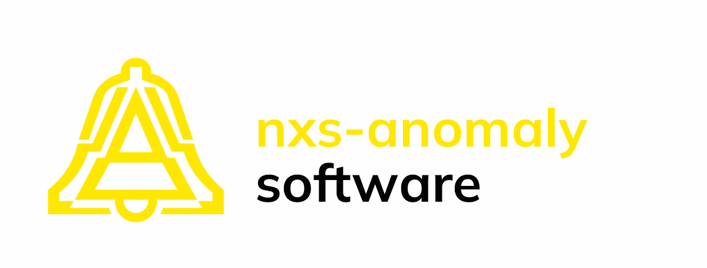
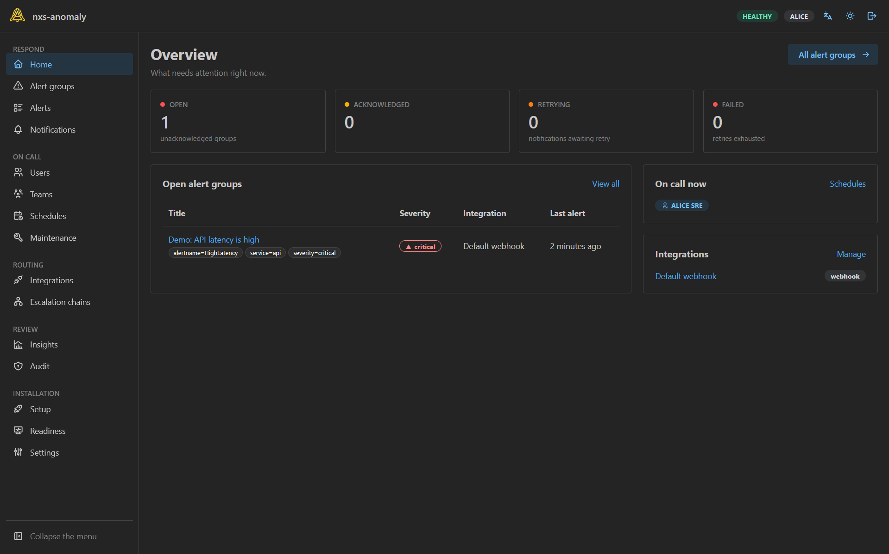
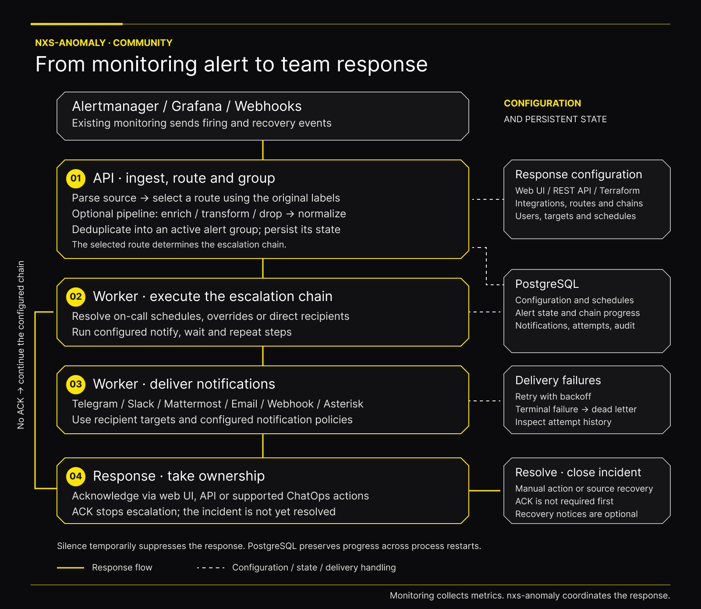

# nxs-anomaly

[](https://github.com/nixys/nxs-anomaly/releases)
[](https://artifacthub.io/packages/helm/nxs-anomaly/nxs-anomaly)
[](https://registry.terraform.io/providers/nixys/nxs-anomaly/latest)
[](https://github.com/nixys/nxs-anomaly/actions/workflows/ci.yml)
[](LICENSE)



**Self-hosted on-call schedules, alert routing and escalation for your existing monitoring.**

Receive alerts from Prometheus Alertmanager, Grafana or JSON webhooks, notify the
person on call, and escalate until someone acknowledges. Follow notifications,
acknowledgements and resolutions in one shared timeline.



## Introduction

### Features

- **Reach the duty engineer:** rotations, timezones, schedule overrides and escalation chains.
- **Use your team's channels:** Telegram, email, webhooks, Slack/Mattermost-compatible endpoints and Asterisk calls.
- **Handle repeated alerts:** grouping, deduplication, acknowledgement, resolution and silencing.
- **See what happened:** alert timelines, delivery attempts, audit history, Prometheus metrics and tracing.
- **Run it your way:** Docker Compose, Kubernetes with Helm, or a Go service with PostgreSQL; configure resources through the API or Terraform.

#### When to use Community Edition

| Requirements                              | Capabilities
|-------------------------------------------|----------------------------------------------------------------------------------------------------------------------------|
| Bring existing monitoring together        | Ingestion from Prometheus Alertmanager, Grafana and generic JSON webhooks                                                  |
| Keep repeated events together             | Deduplication and grouping by alert keys, with routing to escalation chains                                                |
| Reach the current duty engineer           | On-call rotations, timezones, schedule overrides and team-based escalation steps                                           |
| Escalate an unanswered alert              | Notification and wait steps, delivery retries and a dead-letter notification path                                          |
| Use the channels your team already checks | Webhooks, Telegram, email, Slack/Mattermost-compatible endpoints and Asterisk calls                                        |
| Act on an alert                           | Acknowledge, resolve and silence in the web interface; ChatOps actions where configured                                    |
| Understand what happened                  | Alert timelines, audit history and delivery attempts                                                                       |
| Self-host the service                     | Password sign-in, role-based access, REST API, Prometheus metrics, OpenTelemetry tracing and a production security profile |
| Separate access between teams             | Team boundaries: each user sees and acts on their teams' integrations, schedules and alerts, plus unowned ones              |

#### When to use Enterprise Edition

| Requirements | Capabilities |
|---|---|
| Integrate with corporate identity providers | OIDC authentication and centralized access management |
| Analyze incident lifecycle and operational metrics | Event streaming through Kafka and analytics integrations |
| Need dedicated deployment and support options | Enterprise deployment options and commercial support |

### Who can use the tool?

- **SRE and DevOps teams** that already collect alerts and need on-call rotations,
  escalation policies and a clear owner for each response.
- **System administrators** who want to reach the duty engineer through chat,
  email or an Asterisk call instead of watching an alert feed manually.
- **Development teams** that need to receive, acknowledge and resolve their
  service alerts from one interface.
- **Platform teams** evaluating a shared alerting service.

### How it works



## Quickstart

### Try the demo first

One command starts a ready-to-explore installation with a
team, an on-call rotation, an escalation chain, a webhook integration and an alert
already escalating:

```bash
docker compose -f deploy/demo/compose.yaml up -d
```

Open http://localhost:3100 and sign in as `alice` / `demo-password`, the engineer on
call. Notifications are written to the worker log (`docker compose -f deploy/demo/compose.yaml logs worker`);
send more alerts to the webhook URL shown on the Integrations page.
Remove the demo with `docker compose -f deploy/demo/compose.yaml down -v`. The
credentials are public and the stack is for evaluation only — use the installation
guides below for a real deployment.

### Deployment options

| Deployment | Instructions and ready-to-use files |
|---|---|
| Bare metal / VM without containers | [On-premise installation](docs/community/en/INSTALLATION.md#on-premise-bare-metal-or-virtual-machine): build, systemd units, nginx and env presets |
| Docker Compose | [Compose installation](docs/community/en/INSTALLATION.md#docker-compose): ports, health checks, transport configuration and persistent data |
| Kubernetes | [Kubernetes installation](docs/community/en/INSTALLATION.md#kubernetes): Helm, Secrets and explicit StorageClass |
| Configuration files | [Preset catalogue](deploy/quickstart/README.md) |

## Documentation

| I want to… | Read |
|---|---|
| Install and send an alert | [Setup](https://github.com/nixys/nxs-anomaly/blob/main/docs/community/en/SETUP.md) |
| Configure channels, schedules and routing | [Configuration](https://github.com/nixys/nxs-anomaly/blob/main/docs/community/en/CONFIGURATION.md) |
| Understand grouping and escalation | [Alert processing](https://github.com/nixys/nxs-anomaly/blob/main/docs/community/en/ALERT_PROCESSING.md) |
| Automate through the API | [API reference](https://github.com/nixys/nxs-anomaly/blob/main/docs/community/en/API.md) · [OpenAPI](https://github.com/nixys/nxs-anomaly/blob/main/docs/openapi.json) |
| Deploy on Kubernetes | [Helm chart](https://github.com/nixys/nxs-anomaly/blob/main/deploy/helm/nxs-anomaly/README.md) |
| Monitor the service itself | [Metrics](https://github.com/nixys/nxs-anomaly/blob/main/docs/community/en/DEPLOY.md#metrics) · [Alerting rules](https://github.com/nixys/nxs-anomaly/blob/main/docs/community/en/ALERTING_RULES.md) |
| Secure and recover the service | [Security profile](https://github.com/nixys/nxs-anomaly/blob/main/docs/community/en/SECURITY_PROFILE.md) · [Backup and restore](https://github.com/nixys/nxs-anomaly/blob/main/docs/community/en/BACKUP_RESTORE.md) |
| Manage configuration with Terraform | [Provider README](https://github.com/nixys/terraform-provider-nxs-anomaly) |

## Roadmap

What is already released is described above and in the
[release notes](https://github.com/nixys/nxs-anomaly/releases); this section lists
only what is not released yet. Planned items carry no release date.

Already released in **Enterprise Edition** (not part of Community): OIDC single
sign-on, event streaming to Kafka with incident analytics dashboards on
ClickHouse, and scheduled on-call quality reports.

**Planned — Community Edition:**

- Android and iOS apps
- More notification channels and integrations
- Advanced alert grouping and routing rules
- Improved incident workflows and collaboration features
- Enhanced dashboards and operational visibility

**Planned — Enterprise Edition:**

- Advanced team management and access controls beyond the Community team boundaries
- Reports in the web interface
- Enterprise deployment and support capabilities

## Feedback

For support and feedback please contact me:

- Telegram: [@Peter_Rukin](https://t.me/Peter_Rukin)
- Email: p.rukin@nixys.ru

For more information about the product and Enterprise edition:

- Website: [nixys.ru](https://dev-new.nixys.ru/tools/nxs-anomaly/)

For news and discussions subscribe the channels:

- Telegram community (news): [@nxs_anomaly](https://t.me/nxs_anomaly)
- Telegram community (chat): [@nxs_anomaly_chat](https://t.me/nxs_anomaly_chat)

## License

nxs-anomaly is released under the [Apache License 2.0](LICENSE).
