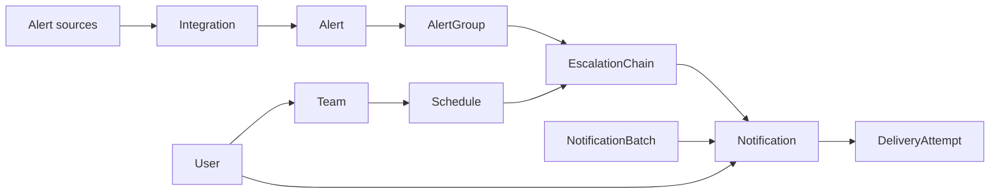
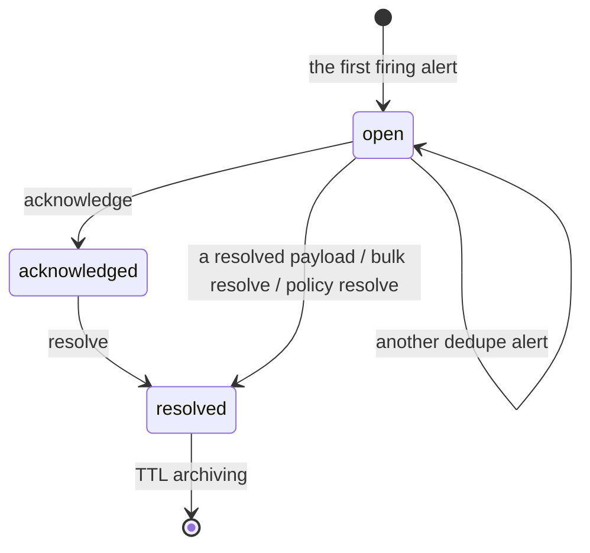

# The domain model

*Русская версия: [DOMAIN_MODEL.md](../ru/DOMAIN_MODEL.md)*

This document describes the main entities of `nxs-anomaly`, how they relate and
how they live. It reflects the current Go runtime: the domain logic lives in
`internal/engine`, storage in PostgreSQL through `internal/store`.

## Overview

`nxs-anomaly` accepts monitoring events, normalises them into alerts, joins alerts
into groups, picks a route, walks an escalation chain and creates notifications.
The worker cycle delivers notifications, retries failures, flushes batch queues
and archives old resolved groups.



## Storage

Every domain entity lives in its own PostgreSQL table. The whole object sits in
`data jsonb`, and frequently used fields are duplicated into typed columns for
indexes and hot-path queries.

| Collection | Table | Purpose |
|---|---|---|
| `users` | `nxs_anomaly_users` | People, contacts, the duty flag, priority |
| `teams` | `nxs_anomaly_teams` | Groups of users |
| `schedules` | `nxs_anomaly_schedules` | On-call schedules and overrides |
| `escalation_chains` | `nxs_anomaly_escalation_chains` | The sequence of escalation steps |
| `integrations` | `nxs_anomaly_integrations` | Alert sources, routing, policy, templates |
| `chatops_channels` | `nxs_anomaly_chatops_channels` | ChatOps channels |
| `chatops_messages` | `nxs_anomaly_chatops_messages` | ChatOps message history (archived by TTL through `NXS_ANOMALY_CHATOPS_MESSAGES_TTL_DAYS`) |
| `mobile_devices` | `nxs_anomaly_mobile_devices` | Registered mobile devices |
| `mobile_sessions` | `nxs_anomaly_mobile_sessions` | Mobile sessions |
| `alerts` | `nxs_anomaly_alerts` | Normalised incoming events |
| `alert_groups` | `nxs_anomaly_alert_groups` | Alert groups and escalation state |
| `notifications` | `nxs_anomaly_notifications` | Delivery tasks and their state |
| `notification_batches` | `nxs_anomaly_notification_batches` | Deferred batches of notifications |
| `notification_delivery_attempts` | `nxs_anomaly_notification_delivery_attempts` | The audit of delivery attempts |
| `notification_policy_runs` | `nxs_anomaly_notification_policy_runs` | Active runs of personal notification policies (BETA-031); ephemeral, `done` ones are pruned |

The typed columns are listed in `store.TypedColumns`. When adding a field that
needs a fast lookup or an index, the migration, `TypedColumns` and `typedValues`
have to be updated together.

## Users and teams

### User

A user describes a person or a technical recipient of notifications.

The key fields:
- `id` — usually prefixed `usr`;
- `name`, `username`, `email`, `phone`, `telegram_id`;
- `timezone` — the IANA zone for displaying time;
- `locale` — `ru-RU`, `en-US` or the empty string ("follow the browser");
- `on_duty` — the manual duty flag;
- `priority` — `high`, `medium`, `low`;
- `notification_targets` — explicit delivery targets: `log`, `webhook`,
  `telegram`, `email`, `call`, `slack`, `mattermost`.

`notification_targets` decide where a notification is actually sent. With no
target set, the `log` fallback is used.

A user can at the same time be a principal of the web interface. Role and
credentials are managed by administrative endpoints, while their own
`locale`/`timezone` go through a separate `PUT /api/v1/auth/preferences` that
cannot change permissions. Credentials and web sessions live in their own tables,
not in the user's public JSON.

### Team

A team groups users.

The key fields:
- `id` — usually prefixed `team`;
- `name`;
- `member_ids` — a list of `users.id`.

Teams are used in schedules, ChatOps channels and the `NOTIFY_TEAM` /
`NOTIFY_DUTY_USERS` escalation steps.

## Schedules

### Schedule

A schedule states who is on call at a point in time.

The key fields:
- `id` — usually prefixed `sch`;
- `name`;
- `team_id`;
- `timezone` — an IANA zone; validated on write, and an unknown zone degrades to
  UTC on read;
- `enabled` — a disabled schedule puts nobody on call (default `true`);
- `notify_on_shift_change` — notify the person coming on that their shift has
  started (default `false`);
- `shift_notification` — internal state of the last shift check (`user_ids`,
  `notified_at`);
- `rotation` — the native rotation (Schedule v2);
- `shifts` — legacy shifts, for schedules created before rotations;
- `overrides`.

A rotation (`rotation`) contains:
- `enabled`;
- `start_at` — the rotation anchor;
- `handoff_interval` and `handoff_unit`: `hours`, `days`, `weeks`;
- `participant_ids` — an ordered list of users; duty is handed round in a circle;
- `restriction` (optional) — a `start`/`end` window (`HH:MM` in the schedule's
  `timezone`) and `days` (`mon`…`sun`, an empty list meaning every day). Outside
  the window there is nobody on call.

A handoff in `days`/`weeks` is counted by the calendar in the schedule's zone, so
a handoff at 10:00 local stays at 10:00 across a daylight-saving change; `hours`
is an absolute duration.

A shift contains:
- `id`;
- `user_id`;
- `start_at`, `end_at`;
- `recurrence`: `none`, `daily`, `weekly`.

An override contains:
- `id`;
- `user_id`;
- `start_at`, `until`;
- `reason`;
- `created_at`/`created_by`, `updated_at`/`updated_by` — the actor comes from the
  request context.

When computing who is on call the sources are checked in order of priority: an
active override → the rotation → legacy shifts. A configured rotation replaces
shifts entirely: in the hours a rotation deliberately leaves uncovered (a
restriction), shifts do not "stand in".

Overrides may overlap (cover on top of cover). Where they overlap, the one
**created later** (`created_at`) wins; on a tie, the last in the list.

A user a schedule still names but who no longer exists does not count as coverage:
that interval becomes a gap, lands in `unknown_users` and in the warnings. When a
user is deleted the engine cleans them out of the rotations, shifts and overrides
of every schedule. If an escalation recipient still cannot be found, the step
writes `notify_skipped_unknown_users` into the group timeline — silently sending
nothing is gone.

### Coverage

`GET /api/v1/schedules/{id}/preview` expands a schedule into continuous intervals
(4 weeks by default, 180 days maximum) and returns `segments`, `gaps`, `overlaps`,
`warnings` and `coverage_ratio`.

A `NOTIFY_SCHEDULE` step will not accept a schedule that has a gap in the next 7
days: the request fails validation until the step explicitly sets
`allow_uncovered: true`.

The write-time gate judges a schedule only at the moment the chain is saved, so
there is a standing re-check: `GET /api/v1/schedules/coverage` and the same
computation in the worker (at most once a minute, reading through the reference
cache). The report shows only what is available to the actor; `schedules_total` is
also counted after scoping, so that "N of M" refers to one and the same set. A
schedule counts as degraded if it is disabled, has gaps or names users that do not
exist; only those an escalation chain actually pages through without
`allow_uncovered` reach the `nxs_anomaly_schedules_degraded` metric.

### Shift-change notifications

With `notify_on_shift_change: true` the worker compares the current on-call set
against the one recorded in `shift_notification` and notifies whoever has just
come on, through their own channels (except `log` — there is nowhere to send). The
first cycle after enabling only records the set and wakes nobody: otherwise
switching the flag on (or an upgrade) would send out notifications about a shift
that has long been under way. The idempotency key is
`shift:<schedule>:<user>:<channel>:<timestamp>`, so restarting the worker does not
duplicate the send. The step first looks at the cached copy of the schedules and,
if there are no handoffs, does not open a transaction at all; when there are, it
loads only the affected schedules and their participants. If the set changed
between that pre-pass and taking the lock (somebody came on who was not loaded),
the step **defers** that schedule without recording a new set: otherwise the
notification would be lost forever. The next cycle reads a fresh copy and sends
it. The `notifications` table is not read here: uniqueness comes from the
committed `shift_notification` under an advisory lock and from the unique index on
`idempotency_key`. The notification is not attached to an alert group
(`alert_group_id` = NULL).

## Integrations and routing

### Integration

An integration is an alert source together with a set of processing rules.

The key fields:
- `id` — usually prefixed `int`;
- `name`;
- `key` / `routing_key` — the key in the ingestion endpoint URL;
- `type` and `source_type`;
- `group_by` — the label fields used for deduplication;
- `routes` — the routing rules;
- `notification_policy`;
- `legacy_pool`;
- `templates` — notification text templates per channel (see
  [Notification templates](#notification-templates));
- `webhook_secret` — optional HMAC verification of the webhook payload;
- `deleted_at` — the soft-delete timestamp; when set, the integration drops out of
  list/page and key lookup.

### Notification templates

Which channels read a template and which do not, and the full list of variables,
are in
[ALERT_PROCESSING.md](ALERT_PROCESSING.md#5-notification-templates).

`templates` is an object of the form `{"<channel>": "<go template>"}`. The key is
a channel name (`telegram`, `email`, `webhook`, `sms`, `phone`); the `default` key
applies when a channel has no template of its own. An empty value, or a missing
key, means the notification is rendered with the built-in format
`[severity] title` + `reason` + `Alert group: <id>`.

The available variables:

| Variable | Description |
|---|---|
| `title` | The alert title (default `Alert notification`) |
| `severity` | The alert severity (default `unknown`) |
| `reason` | Why the notification was sent (escalation, resolve, and so on) |
| `group_id` | The alert group ID |
| `status` | The group status (default `open`) |
| `user_name` | The recipient's name |
| `user_username` | The recipient's username |

The forms `{{ .title }}`, `{{ title }}`, `{{.title}}` are supported, as are the
CamelCase aliases (`{{ .Title }}`, `{{ .Severity }}`, `{{ .GroupID }}`,
`{{ .UserName }}`). The ordinary `text/template` constructs are available
(`{{ if .severity }}…{{ end }}`).

An unknown placeholder does not break delivery: the template is rendered through
the fallback path, that placeholder stays in the text as written, and
`notification_template_render_failed` is logged (or
`notification_template_parse_failed` on a syntax error).

### Soft-deleting integrations

`DELETE /api/v1/integrations/{id}` performs a **soft delete**: it sets
`deleted_at = NOW()` and keeps the row in the database. That avoids a race
condition against a live ingest stream.

The effects:
- `GET /api/v1/integrations` and `ListCollectionPage` do not return the deleted
  integration;
- ingest by key returns `404 integration key not found`;
- `GetItem` by ID still returns the record (audit access).

The supported ingestion endpoints:
- the generic webhook;
- Prometheus Alertmanager;
- PagerDuty;
- VictorOps / Splunk On-Call;
- Grafana Alerting;
- the legacy `/v2/alert/pool`.

### Route

A route picks the escalation chain for an incoming alert payload.

The key fields:
- `id`;
- `name`;
- `match_type`: `all`, `labels`, `regex`;
- `labels`, or the regex settings;
- `is_default`;
- `escalation_chain_id`.

If no matching route is found, the default route is used. If there is no default
route either, ingest returns a routing error.

### MaintenanceWindow

A maintenance window ties an interval `[starts_at, ends_at)` to one or more
integrations and, optionally, to a team. New groups during the window are created
`silenced` until the latest bound among overlapping windows; the alerts are still
stored. Groups already escalating are not changed. The heartbeat check also
respects the window and does not raise `SourceSilent` for a source stopped on
purpose.

The key fields: `id`, `name`, `reason`, `team_id`, `integration_ids`,
`starts_at`, `ends_at`. The bounds are stored in UTC; the API accepts RFC 3339.

### Notification Policy

`notification_policy` governs the delivery channels and batching behaviour.

The key fields:
- `channels` — the list of channels to use;
- `batch_timeout_seconds`;
- `batch_deadline_seconds`;
- `emergency_user_id`;
- `epic_user_id`;
- `epic_threshold_count`;
- `epic_threshold_seconds`.

When the batch settings are above zero, notifications first land in
`notification_batches` and are flushed later by the worker cycle.

### Personal notification policies (BETA-031)

A user may have a `notification_policies` field with the keys `default` and/or
`important`; each is an ordered list of steps `{channel, target?, wait_minutes}`
(`channel` ∈ telegram/email/webhook/call/log). This is **opt-in**: without a
policy a user stays on the old path (all `notification_targets` fired at once).

When a user is paged and has a selected policy, `notifyUsers` starts a **run**
(`notification_policy_runs`) instead of a blast: a step sends to a channel, then
waits `wait_minutes` before the next (a fallback). Steps with `wait=0` run
back-to-back in a single cycle. A run is a durable state machine:
`advanceNotificationPolicyRuns` in the worker cycle moves it through time under an
advisory lock and **stops the moment the group is acknowledged or resolved** (the
fallback exists to page until somebody answers). A finished run is marked `done`
and pruned. Step idempotency uses the key `policy:<run_id>:<step_index>`; run
deduplication is by `(group, user, escalation_key)`, where
`escalation_key = current_step:repeat_count:policy`.

Choosing a policy: a `NOTIFY_USER` escalation step may carry `notify_policy`
(`important`/`default`, default `default`); an empty `important` falls back to
`default`. `MigrateUserTargetsToDefaultPolicy` moves legacy
`notification_targets` into a `default` policy (one step per target, `wait=0` —
the behaviour does not change). The ChatOps and mobile fan-outs remain separate
surfaces and always go.

## Alerts and groups

### Alert

An alert is a normalised incoming event.

The key fields:
- `id`;
- `integration_id`;
- `route_id`;
- `alert_group_id`;
- `status`: usually `firing` or `resolved`;
- `severity`;
- `title`, `message`;
- `labels`, `annotations`;
- `starts_at`, `ends_at`, `received_at`;
- `source`, `external_url`, `fingerprint`.

An alert is always tied to an integration. If it is part of an active dedupe
group, it is added to the existing `AlertGroup`; otherwise a new group is created.

### AlertGroup

The alert group is the central aggregate of the domain model. It holds the state
of the incident, the current escalation position and the list of related alert
IDs.

The key fields:
- `id`;
- `integration_id`;
- `route_id`;
- `escalation_chain_id`;
- `dedupe_key`;
- `status`: `open`, `acknowledged`, `resolved`;
- `severity`;
- `title`;
- `labels`;
- `alert_ids`;
- `alert_count`;
- `current_step`;
- `repeat_count`;
- `next_run_at`;
- `last_received_at`;
- `acknowledged_at`;
- `resolved_at`;
- `notification_channels`;
- `logs`.

The lifecycle:



Points worth noting:
- a resolved group takes no further part in escalation;
- `next_run_at` is what the worker cycle uses to continue after a `WAIT`;
- `logs` holds the group's domain events, bounded by `maxGroupLogs`.

## Escalation

### EscalationChain

An escalation chain is an ordered list of steps.

The key fields:
- `id` — usually prefixed `esc`;
- `name`;
- `steps`.

The supported steps:

| Step | Purpose |
|---|---|
| `WAIT` | Set `next_run_at` and continue later |
| `NOTIFY_USER` | Notify specific users |
| `NOTIFY_SCHEDULE` | Notify a schedule's on-call users |
| `NOTIFY_TEAM` | Notify every member of a team |
| `NOTIFY_EMERGENCY` | Notify the emergency user |
| `NOTIFY_DUTY_USERS` | Notify a team's duty users |
| `TRIGGER_WEBHOOK` | Create a webhook notification |
| `CREATE_ISSUE` | Create an issue in an external tracker |
| `RESOLVE` | Resolve the group |
| `REPEAT` | Return to an earlier step a bounded number of times |

`RunWorkerCycle` is the complete scheduler entry point: it handles due
escalations, flushes batched notifications, deliveries, retries and TTL archiving.
`ProcessDueEscalations` is the narrow manual endpoint: due escalations plus
scheduled retries.

## Notifications and delivery

### Notification

A notification is a delivery task, or a record of a logical notification.

The key fields:
- `id` — usually prefixed `ntf`;
- `alert_group_id`;
- `user_id`;
- `channel`;
- `target`;
- `status`;
- `reason`;
- `idempotency_key`;
- `retry_count`;
- `next_retry_at`;
- `last_error`;
- `batch_id`, `batch_key`;
- `provider_status`;
- `payload`.

The statuses:
- `delivered` — the provider accepted the notification. Set **only** after a
  successful adapter call: a notification cannot be born delivered;
- `delivery_scheduled` — the delivery adapter still has to run;
- `delivering` — claimed by a worker and being delivered right now
  (claim-then-deliver, migration 0017); anything stuck longer than
  `NXS_ANOMALY_NOTIFICATION_CLAIM_TIMEOUT_SECONDS` is returned to the queue by the
  reaper;
- `retry_scheduled` — delivery failed and is waiting for a retry;
- `retrying` — a retry claimed by a worker and running right now (the same claim
  semantics as `delivering`);
- `failed` — the retries are exhausted, or the delivery context was lost;
- `skipped` — **terminal**: the channel has no transport on this installation, the
  notification was never handed to a provider, and there will be no retries. The
  reason is in `provider_status` (`not_configured`). This is not "delivered"
  (nobody received anything) and not "failed" (nothing broke);
- `batched` — the notification is waiting for its batch to flush.

### Channels and their transports

| Channel | Transport | Unconfigured |
|---|---|---|
| `log` | a line in the service log (genuinely written) | — |
| `webhook`, `slack`, `mattermost` | HTTP POST | `failed` (the URL is set in the target) |
| `telegram` | the Telegram Bot API | `skipped` without `NXS_ANOMALY_TELEGRAM_BOT_TOKEN` |
| `email` | SMTP | `skipped` without `NXS_ANOMALY_SMTP_HOST` |
| `call` | Asterisk AMI | `skipped` if no instance is configured |
| `mobile` | the operator's push relay (`NXS_ANOMALY_MOBILE_PUSH_URL`), ACK = 2xx; `POST /api/v1/users/{id}/test-push` checks it live | `skipped` |
| `chatops` | the channel's incoming webhook (`webhook_url`) | `skipped` |

### The push-relay contract

`NXS_ANOMALY_MOBILE_PUSH_URL` is an endpoint the operator deploys themselves
(nxs-anomaly contains no FCM/APNs client; a full mobile application is outside the
beta's scope). It receives a `POST` with JSON:

```json
{
  "device_id":  "mdev_…",
  "platform":   "ios | android",
  "push_token": "<the device token>",
  "user_id":    "usr_…",
  "title":      "…",
  "severity":   "critical",
  "reason":     "escalation step 2",
  "group_id":   "grp_…"
}
```

If `NXS_ANOMALY_MOBILE_PUSH_TOKEN` is set, it goes out as `Authorization: Bearer`.
**The ACK is a 2xx response**: only that moves the notification to `delivered`.
Any other code, or a timeout, is `failed` with the usual retry policy; the absence
of the variable itself is `skipped`. To check the chain live:
`POST /api/v1/users/{id}/test-push` (a real call to the relay, with a per-device
verdict in the response).

A device token (`push_token`) and a ChatOps channel's `webhook_url` are
credentials, so the API masks them on read paths: the push token always, the
webhook for everyone except those who may edit configuration (otherwise the
settings form could not show it). Delivery reads the rows through the store and
sees the real values.

### ChatOps: in and out

**Outbound** is the channel's incoming webhook (`webhook_url`). A row in
`chatops_messages` now carries `delivery_status` (`queued` /
`skipped_no_transport`) and `notification_id`, so the message history no longer
claims a send that never happened.

**Inbound** is `POST /integrations/v1/chatops/slack` and `/telegram`. This is not
an internal API: the request is authenticated by the platform's own signature
(Slack v0 HMAC-SHA256 over the raw body plus a 5-minute freshness window against
replay; Telegram uses `X-Telegram-Bot-Api-Secret-Token`, compared in constant
time). With no secret configured the endpoint answers 501 rather than accepting
unsigned commands. The channel is looked up by `external_id` (for telegram the
fallback is `name`, where the chat id historically lives). The actor is
`chatops:<platform>` with the responder role: a signature is enough for
ack/resolve and for nothing else.

Interactive ack/resolve buttons are not implemented: a full Slack application is
outside the beta's scope. What is implemented is the part that is a security
property rather than integration depth.

There is no full mobile application and no signed Slack integration in the beta —
and the system no longer hides it: without a transport a notification gets
`skipped`, the `nxs_anomaly_notifications_skipped_total{channel,reason}` counter
rises, and on the group page the person on call sees a banner saying some
notifications reached nobody.

### NotificationBatch

A batch groups the notifications of one integration/dedupe group.

The key fields:
- `id` — usually prefixed `nbat`;
- `batch_key`;
- `status`: `open`, then `flushed`;
- `flush_at`;
- `deadline_at`;
- `alert_group_id`;
- `integration_id`;
- `notification_count`.

The worker picks up due batches by `flush_at <= now` and moves the related
notifications into delivery.

### DeliveryAttempt

A delivery attempt records every external delivery try.

The key fields:
- `id` — usually prefixed `dlat`;
- `notification_id`;
- `channel`;
- `target`;
- `attempt`;
- `status` — `delivered`, `failed` or `skipped`;
- `provider_status` — which transport answered (`mobile_push`,
  `telegram_sendMessage`), or why there was no transport (`not_configured`);
- `provider_code` — the provider's response code (the HTTP status where there is
  one);
- `provider_response` — the response, truncated to 512 characters and redacted:
  token and password values are masked at write time, not at read time;
- `duration_ms` — how long the provider call took;
- `error`;
- `started_at`, `finished_at`.

Delivery attempts are deleted along with the notification when resolved groups are
archived by TTL.

## ChatOps and mobile

### ChatOps Channel

A ChatOps channel links a user or a team to an external channel.

It describes a **shared chat**: a delivery address and the visibility boundary for
commands typed there. The bot's private correspondence with a person has no
channel and needs none — a command or a button press from a direct message runs as
the user whose `telegram_id` matched the sender, bounded by that person's own
teams. An unidentified sender in a chat with no channel is refused.

The key fields:
- `id`;
- `platform`: `telegram`, `slack`, `mattermost`, for example;
- `name`;
- `team_id` or `user_id`;
- `commands_enabled`;
- `notifications_enabled`.

### ChatOps Message

A message stores inbound commands and outbound responses:
- `channel_id` (empty for a command from a direct message — it has no channel);
- `direction`;
- `actor`;
- `command`;
- `response`;
- `created_at`.

### Mobile Device and Mobile Session

A mobile device holds a push token and a platform for a user. A mobile session
ties a user/device to a session token. The mobile API uses the session token for
the dashboard, acknowledge and resolve.

## Archiving and retention

Resolved groups are deleted by the worker cycle through `ArchiveResolvedGroups`.
The TTL is set by `NXS_ANOMALY_ALERT_GROUP_TTL_DAYS` (default 30).

What is deleted:
- `alert_groups`;
- the related `alerts`;
- the related `notifications`;
- the related `notification_delivery_attempts`.

The archiving metric is `nxs_anomaly_groups_archived_total`.

A separate retention sweep is governed by four independent horizons:
`NXS_ANOMALY_AUDIT_RETENTION_DAYS`,
`NXS_ANOMALY_NOTIFICATION_RETENTION_DAYS`,
`NXS_ANOMALY_DELIVERY_ATTEMPT_RETENTION_DAYS` and
`NXS_ANOMALY_WEB_SESSION_RETENTION_DAYS`. Zero means "do not delete".
Notifications are deleted only in terminal statuses. The result is exported as
`nxs_anomaly_retention_deleted_total{category=...}`.

Exporting and erasing a user's data are separate admin operations. Erasure deletes
credentials, sessions, devices and ChatOps bindings, and keeps the audit and
delivery facts with pseudonymised identifiers. The full boundaries are in
[DATA_INVENTORY.md](DATA_INVENTORY.md).

## Invariants

- Every domain object has a string `id`.
- Every record stores its full JSONB payload in `data`.
- Hot-path fields used in SQL filters must be typed columns.
- `integrations.key` is unique and is used as the public routing key.
- An active group is identified by the pair `integration_id + dedupe_key` while
  its status is not `resolved`.
- Worker paths are bounded by a batch size, so that unbounded queues are never
  pulled into memory.
- The management API may read lists through whitelist filters only: arbitrary SQL
  identifiers from a request are not allowed.
- Alert-group status transitions (acknowledge/resolve/unresolve/unacknowledge/
  silence) and their guard invariants are centralised in
  `internal/model.AlertGroup` — a typed wrapper over the raw map. New transitions
  go there, not inline in the mutators. The engine helpers (`advanceGroupLocked`,
  `notifyUsers`, `triggerWebhook`, …) take a `model.AlertGroup`, not a
  `map[string]any`.
- The notification delivery/retry state machine (`delivery_scheduled → delivered |
  retry_scheduled → … → failed`, batch flush) is centralised in
  `internal/model.Notification` under the same wrapper pattern.
- All hot collections (`alerts`, `alert_groups`, `notifications`,
  `notification_batches`) are typed `store.Record`s (see
  [Writing and the snapshot diff](#writing-and-the-snapshot-diff)). The remaining
  collections stay on the map-backed mapRecord fallback.

## Writing and the snapshot diff

`UpdateCollectionsFiltered` loads only the rows it needs through typed filters
(a LoadSpec) and saves only the ones that actually changed. The mechanism:

1. After `loadPartialStateTx` a **baseline** is taken: every loaded row is
   marshalled to JSON through `Record.MarshalData`.
2. After the mutator, every row of the save collections is marshalled again; if
   the bytes match the baseline, the row is skipped.
3. New rows (with no baseline) are always written.

That gives two guarantees: (a) filtered loading is safe — rows that were not
loaded have no baseline and are not written; (b) the lost-update race is
eliminated (writing only genuinely changed rows does not clobber concurrent
updates made under other advisory lock keys).

The typed models
(`internal/model/{alertgroup,alert,notification,notification_batch}.go`) implement
`store.Record` with a `MarshalData` that is byte-for-byte equivalent to the
previous mapRecord representation. That preserves byte stability for existing rows
in the database (round-trip tests in `*_test.go` guarantee that any future
replacement of the internal representation also keeps byte equivalence — see
`TestAlertGroupByteStableRoundTrip`).

## Where to find the implementation

| Area | Files |
|---|---|
| Typed domain models (state machine + `store.Record`) | `internal/model/alertgroup.go`, `internal/model/alert.go`, `internal/model/notification.go`, `internal/model/notification_batch.go` |
| Ingest core (IngestAlert, Alertmanager) | `internal/engine/ingest.go` |
| Ingest sources (PagerDuty, VictorOps, Grafana, LegacyPool) | `internal/engine/ingest_sources.go` |
| Routing and sanitizers | `internal/engine/routing.go`, `internal/engine/sanitize.go` |
| Entity CRUD | `internal/engine/crud.go`, `crud_chains.go`, `crud_integrations.go`, `crud_chatops.go`, `crud_mobile.go` |
| Maintenance windows | `internal/engine/maintenance.go` |
| Retention and personal data | `internal/engine/retention.go`, `personal_data.go`, `data_policy.go` |
| Locale and user preferences | `internal/engine/locale.go`, `frontend/src/i18n/` |
| History, DebugRoute, SeedDemo | `internal/engine/history.go`, `internal/engine/seed.go` |
| Escalation (state transitions) | `internal/engine/escalation.go` |
| The worker cycle | `internal/engine/worker.go` |
| Escalation steps | `internal/engine/steps.go` |
| The reference cache (short TTL) | `internal/engine/refcache.go` |
| Notifications, delivery adapters | `internal/engine/notifications.go`, `internal/engine/delivery.go`, `internal/engine/delivery_adapters.go`, `internal/engine/delivery_config.go` |
| HTTP lifecycle (Server, New, runWorkerLoop, registerRoutes) | `internal/server/server.go` |
| Config (`Config` + `ConfigFromEnv` + API key scopes) | `internal/server/config.go` |
| HTTP handlers (`/live`, `/health`, `/metrics`, the `/api/v1` entry) | `internal/server/handlers.go` |
| Webhook ingest handlers (6 sources) | `internal/server/handlers_ingest.go` |
| Prometheus metrics | `internal/server/metrics.go` |
| The rate limiter (token bucket) | `internal/server/rate_limiter.go` |
| The `/api/v1` router, auth, middleware, HTTP I/O helpers | `internal/server/server_api.go` |
| The PostgreSQL store (load/save/dirty-diff/Record interface) | `internal/store/store.go`, `store_record.go`, `store_crud.go`, `store_lookups.go`, `store_helpers.go`, `store_notify.go` |
| Migrations | `internal/store/migrations/*.sql` |
