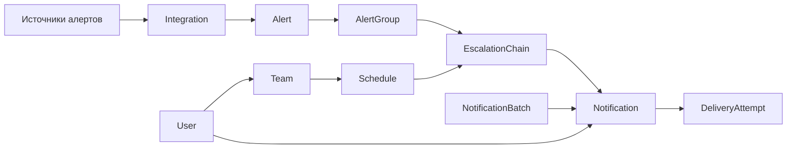
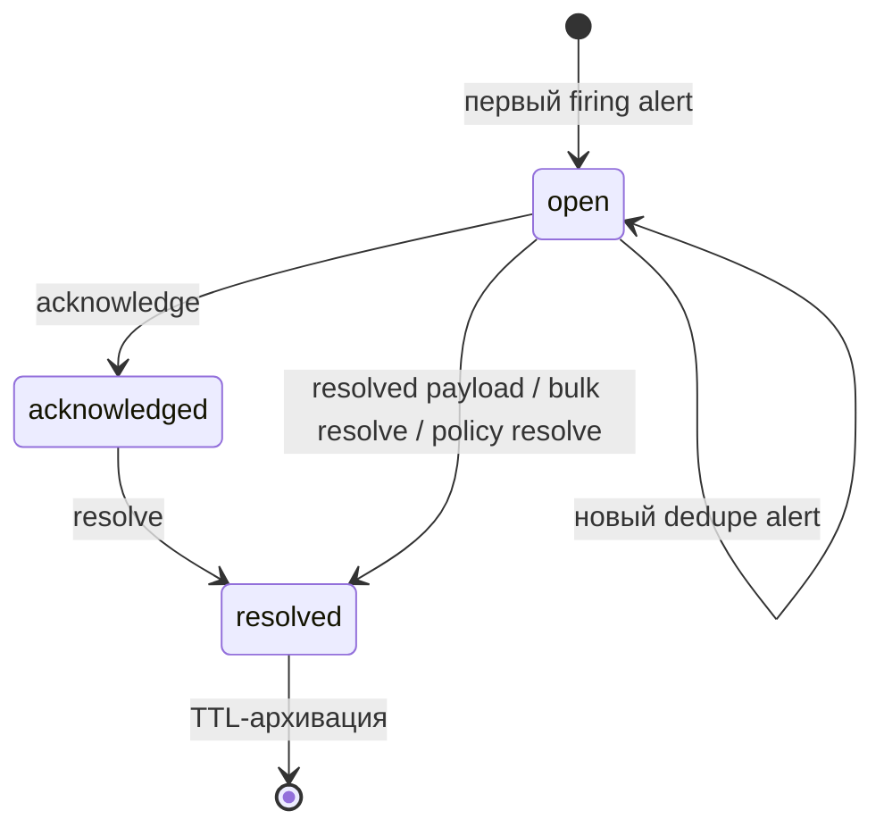

# Доменная модель

*In English: [DOMAIN_MODEL.md](../en/DOMAIN_MODEL.md)*

Этот документ описывает основные сущности `nxs-anomaly`, их связи и жизненные циклы. Он отражает текущий Go-runtime: доменная логика находится в `internal/engine`, хранение — в PostgreSQL через `internal/store`.

## Обзор

`nxs-anomaly` принимает события мониторинга, нормализует их в алерты, объединяет алерты в группы, выбирает маршрут, выполняет цепочку эскалации и создаёт уведомления. Worker-цикл доставляет уведомления, повторяет неудачные попытки, закрывает batch-очереди и архивирует старые resolved-группы.



## Хранение

Каждая доменная сущность хранится в отдельной таблице PostgreSQL. Полный объект лежит в `data jsonb`, а часто используемые поля дублируются в типизированные колонки для индексов и hot-path запросов.

| Коллекция | Таблица | Назначение |
|---|---|---|
| `users` | `nxs_anomaly_users` | Люди, контакты, duty-флаг, приоритет |
| `teams` | `nxs_anomaly_teams` | Группы пользователей |
| `schedules` | `nxs_anomaly_schedules` | Расписания дежурств и overrides |
| `escalation_chains` | `nxs_anomaly_escalation_chains` | Последовательность шагов эскалации |
| `integrations` | `nxs_anomaly_integrations` | Источники алертов, routing, policy, templates |
| `chatops_channels` | `nxs_anomaly_chatops_channels` | Каналы ChatOps |
| `chatops_messages` | `nxs_anomaly_chatops_messages` | История ChatOps-сообщений (TTL-архивация через `NXS_ANOMALY_CHATOPS_MESSAGES_TTL_DAYS`) |
| `mobile_devices` | `nxs_anomaly_mobile_devices` | Зарегистрированные мобильные устройства |
| `mobile_sessions` | `nxs_anomaly_mobile_sessions` | Мобильные сессии |
| `alerts` | `nxs_anomaly_alerts` | Нормализованные входящие события |
| `alert_groups` | `nxs_anomaly_alert_groups` | Группы алертов и состояние эскалации |
| `notifications` | `nxs_anomaly_notifications` | Задачи доставки и их состояние |
| `notification_batches` | `nxs_anomaly_notification_batches` | Отложенные пачки уведомлений |
| `notification_delivery_attempts` | `nxs_anomaly_notification_delivery_attempts` | Аудит попыток доставки |
| `notification_policy_runs` | `nxs_anomaly_notification_policy_runs` | Активные прогоны личных политик уведомлений (BETA-031); эфемерны, `done` пруним |

Типизированные колонки перечислены в `store.TypedColumns`. При добавлении поля, по которому нужен быстрый lookup или индекс, нужно синхронно обновить миграцию, `TypedColumns` и `typedValues`.

## Пользователи и команды

### User

Пользователь описывает человека или технического получателя уведомлений.

Ключевые поля:
- `id` — обычно с префиксом `usr`;
- `name`, `username`, `email`, `phone`, `telegram_id`;
- `timezone` — IANA-зона для отображения времени;
- `locale` — `ru-RU`, `en-US` или пустая строка («следовать браузеру»);
- `on_duty` — ручной duty-флаг;
- `priority` — `high`, `medium`, `low`;
- `notification_targets` — явные цели доставки: `log`, `webhook`, `telegram`, `email`, `call`, `slack`, `mattermost`.

`notification_targets` определяют, куда реально отправлять уведомление. Если цель не задана, используется fallback `log`.

Пользователь одновременно может быть principal веб-интерфейса. Role и
credentials управляются административными endpoint-ами, а собственные
`locale`/`timezone` — отдельным `PUT /api/v1/auth/preferences`, который не может
изменить права. Учётные данные и web-сессии лежат в отдельных таблицах, а не в
публичном JSON пользователя.

### Team

Команда группирует пользователей.

Ключевые поля:
- `id` — обычно с префиксом `team`;
- `name`;
- `member_ids` — список `users.id`.

Команды используются в расписаниях, ChatOps-каналах и шагах эскалации `NOTIFY_TEAM` / `NOTIFY_DUTY_USERS`.

## Расписания

### Schedule

Расписание задаёт, кто дежурит в момент времени.

Ключевые поля:
- `id` — обычно с префиксом `sch`;
- `name`;
- `team_id`;
- `timezone` — IANA-зона; проверяется при записи, на чтении неизвестная зона деградирует до UTC;
- `enabled` — выключенное расписание не дежурит никого (по умолчанию `true`);
- `notify_on_shift_change` — уведомлять заступающего о начале смены (по умолчанию `false`);
- `shift_notification` — служебное состояние последней проверки смены (`user_ids`, `notified_at`);
- `rotation` — нативная ротация (Schedule v2);
- `shifts` — legacy-смены расписаний, созданных до ротаций;
- `overrides`.

Ротация (`rotation`) содержит:
- `enabled`;
- `start_at` — якорь ротации;
- `handoff_interval` и `handoff_unit`: `hours`, `days`, `weeks`;
- `participant_ids` — упорядоченный список пользователей, передача дежурства идёт по кругу;
- `restriction` (опционально) — окно `start`/`end` (`HH:MM` по `timezone` расписания) и
  `days` (`mon`…`sun`, пустой список = каждый день). Вне окна дежурного нет.

Передача дежурства в `days`/`weeks` считается по календарю в зоне расписания, поэтому
handoff в 10:00 local остаётся в 10:00 через переход на летнее время; `hours` —
абсолютная длительность.

Смена (`shift`) содержит:
- `id`;
- `user_id`;
- `start_at`, `end_at`;
- `recurrence`: `none`, `daily`, `weekly`.

Override содержит:
- `id`;
- `user_id`;
- `start_at`, `until`;
- `reason`;
- `created_at`/`created_by`, `updated_at`/`updated_by` — actor берётся из request context.

При вычислении on-call источники проверяются по приоритету: active override → ротация →
legacy-смены. Настроенная ротация полностью замещает смены: в часы, которые ротация
намеренно не покрывает (restriction), смены не «подставляются».

Override-ы могут пересекаться (прикрытие поверх прикрытия). В пересечении побеждает
**созданный позже** (`created_at`), при равенстве — последний в списке.

Пользователь, которого расписание всё ещё называет, но которого больше нет, покрытием
не считается: такой интервал становится пробелом, попадает в `unknown_users` и в
предупреждения. При удалении пользователя движок сам вычищает его из ротаций, смен и
override-ов всех расписаний. Если получатель эскалации всё же не найден, шаг пишет в
timeline группы `notify_skipped_unknown_users` — молчаливой непосылки больше нет.

### Покрытие

`GET /api/v1/schedules/{id}/preview` разворачивает расписание в непрерывные интервалы
(по умолчанию на 4 недели, максимум 180 дней) и возвращает `segments`, `gaps`,
`overlaps`, `warnings` и `coverage_ratio`.

Шаг `NOTIFY_SCHEDULE` не примет расписание, в котором есть пробел в ближайшие 7 дней:
запрос падает с ошибкой валидации, пока в шаге явно не выставлен `allow_uncovered: true`.

Гейт при записи судит расписание только в момент сохранения цепочки, поэтому есть
постоянная перепроверка: `GET /api/v1/schedules/coverage` и тот же расчёт в воркере
(не чаще раза в минуту, чтение через reference-кэш). Отчёт показывает только
доступные актору; `schedules_total` тоже считается после скоупинга, чтобы «N из M»
относилось к одному и тому же множеству. Расписание считается деградировавшим, если оно выключено, имеет
пробелы или называет несуществующих пользователей; в метрику `nxs_anomaly_schedules_degraded`
попадают только те из них, через которые реально ходит escalation chain без
`allow_uncovered`.

### Уведомления о смене дежурства

При `notify_on_shift_change: true` worker сравнивает текущий состав дежурных с
записанным в `shift_notification` и уведомляет тех, кто только что заступил, по их
собственным каналам (кроме `log` — отправлять некуда). Первый цикл после включения
только записывает состав и никого не будит: иначе включение флага (или апгрейд)
разослало бы уведомления о смене, которая давно идёт. Ключ идемпотентности —
`shift:<schedule>:<user>:<channel>:<timestamp>`, поэтому перезапуск воркера не
дублирует отправку. Шаг сначала смотрит на кэшированную копию расписаний и, если
передач дежурства нет, не открывает транзакцию вообще; когда есть — грузит только
затронутые расписания и их участников. Если состав успел смениться между этим
пре-проходом и захватом лока (заступил тот, кого не загрузили), шаг **откладывает**
расписание, не записывая новый состав: иначе уведомление было бы потеряно навсегда.
Следующий цикл читает свежую копию и досылает. Таблица `notifications` при этом не читается:
уникальность обеспечивают зафиксированное `shift_notification` под advisory-локом и
unique-индекс по `idempotency_key`. Уведомление не привязано к alert group (`alert_group_id` = NULL).

## Интеграции и маршрутизация

### Integration

Интеграция — источник алертов и набор правил обработки.

Ключевые поля:
- `id` — обычно с префиксом `int`;
- `name`;
- `key` / `routing_key` — ключ в URL ingestion endpoint;
- `type` и `source_type`;
- `group_by` — поля labels для дедупликации;
- `routes` — правила маршрутизации;
- `notification_policy`;
- `legacy_pool`;
- `templates` — шаблоны текста уведомлений по каналам (см. [Шаблоны уведомлений](#шаблоны-уведомлений));
- `webhook_secret` — опциональная HMAC-проверка webhook payload;
- `deleted_at` — timestamp soft-удаления; если задан, интеграция исключается из list/page и lookup по ключу.

### Шаблоны уведомлений

Какие каналы шаблон читают, а какие нет, и полный список переменных —
в [ALERT_PROCESSING.md](ALERT_PROCESSING.md#5-шаблоны-уведомлений).

`templates` — объект вида `{"<channel>": "<go template>"}`. Ключ — имя канала
(`telegram`, `email`, `webhook`, `sms`, `phone`); ключ `default` применяется,
если для канала нет своего шаблона. Пустое значение или отсутствие ключа —
уведомление рендерится встроенным форматом `[severity] title` + `reason` +
`Alert group: <id>`.

Доступные переменные:

| Переменная | Описание |
|---|---|
| `title` | Заголовок алерта (по умолчанию `Alert notification`) |
| `severity` | Severity алерта (по умолчанию `unknown`) |
| `reason` | Причина уведомления (эскалация, resolve и т.п.) |
| `group_id` | ID группы алертов |
| `status` | Статус группы (по умолчанию `open`) |
| `user_name` | Имя получателя |
| `user_username` | Username получателя |

Поддерживаются формы `{{ .title }}`, `{{ title }}`, `{{.title}}`, а также
CamelCase-алиасы (`{{ .Title }}`, `{{ .Severity }}`, `{{ .GroupID }}`,
`{{ .UserName }}`). Доступны обычные конструкции `text/template`
(`{{ if .severity }}…{{ end }}`).

Неизвестный плейсхолдер не ломает доставку: шаблон рендерится fallback-путём и
такой плейсхолдер остаётся в тексте как есть, а в лог пишется
`notification_template_render_failed` (или `notification_template_parse_failed`
при синтаксической ошибке).

### Soft-delete интеграций

`DELETE /api/v1/integrations/{id}` выполняет **soft-delete**: устанавливает `deleted_at = NOW()` и сохраняет строку в БД. Это предотвращает race condition при активном ingest-потоке.

Эффекты:
- `GET /api/v1/integrations` и `ListCollectionPage` не возвращают удалённую интеграцию;
- ingest по ключу возвращает `404 integration key not found`;
- `GetItem` по ID возвращает запись (аудит-доступ).

Поддерживаемые ingestion endpoints:
- generic webhook;
- Prometheus Alertmanager;
- PagerDuty;
- VictorOps / Splunk On-Call;
- Grafana Alerting;
- legacy `/v2/alert/pool`.

### Route

Route выбирает escalation chain для входящего alert payload.

Ключевые поля:
- `id`;
- `name`;
- `match_type`: `all`, `labels`, `regex`;
- `labels` или regex-настройки;
- `is_default`;
- `escalation_chain_id`.

Если подходящий route не найден, используется default route. Если default route тоже отсутствует, ingest возвращает ошибку маршрутизации.

### MaintenanceWindow

Окно обслуживания связывает интервал `[starts_at, ends_at)` с одной или
несколькими интеграциями и, опционально, командой. Новые группы во время окна
создаются `silenced` до самой поздней границы пересекающихся окон; алерты при
этом сохраняются. Уже эскалирующие группы не меняются. Проверка heartbeat тоже
учитывает окно и не создаёт `SourceSilent` для планово остановленного источника.

Ключевые поля: `id`, `name`, `reason`, `team_id`, `integration_ids`,
`starts_at`, `ends_at`. Границы хранятся в UTC, API принимает RFC 3339.

### Notification Policy

`notification_policy` управляет каналами доставки и batch-поведением.

Ключевые поля:
- `channels` — список каналов, которые нужно использовать;
- `batch_timeout_seconds`;
- `batch_deadline_seconds`;
- `emergency_user_id`;
- `epic_user_id`;
- `epic_threshold_count`;
- `epic_threshold_seconds`.

Если batch-настройки больше нуля, уведомления сначала попадают в `notification_batches`, а потом flush-ятся worker-циклом.

### Личные политики уведомлений (BETA-031)

У пользователя может быть поле `notification_policies` с ключами `default` и/или
`important`; каждый — упорядоченный список шагов `{channel, target?, wait_minutes}`
(`channel` ∈ telegram/email/webhook/call/log). Это **opt-in**: без политики
пользователь остаётся на старом пути (все `notification_targets` шлются разом).

Когда пользователя пейджат и у него есть выбранная политика, `notifyUsers`
запускает **прогон** (`notification_policy_runs`) вместо блэста: шаг посылает
канал, затем ждёт `wait_minutes` перед следующим (fallback). Шаги с `wait=0` идут
подряд в одном цикле. Прогон — это durable state machine: `advanceNotificationPolicyRuns`
в worker-цикле двигает его во времени под advisory-локом и **останавливает, как
только группа acknowledged/resolved** (fallback существует, чтобы пейджить до
ответа). Завершённый прогон помечается `done` и пруним. Идемпотентность шага —
ключ `policy:<run_id>:<step_index>`; дедупликация прогона — по
`(group, user, escalation_key)`, где `escalation_key = current_step:repeat_count:policy`.

Выбор политики: escalation-шаг `NOTIFY_USER` может нести `notify_policy`
(`important`/`default`, по умолчанию `default`); пустая `important` падает на
`default`. `MigrateUserTargetsToDefaultPolicy` переносит legacy-`notification_targets`
в `default`-политику (по шагу на таргет, `wait=0` — поведение не меняется).
Chatops/mobile fan-out остаются отдельными поверхностями и идут всегда.

## Алерты и группы

### Alert

Alert — нормализованное входящее событие.

Ключевые поля:
- `id`;
- `integration_id`;
- `route_id`;
- `alert_group_id`;
- `status`: обычно `firing` или `resolved`;
- `severity`;
- `title`, `message`;
- `labels`, `annotations`;
- `starts_at`, `ends_at`, `received_at`;
- `source`, `external_url`, `fingerprint`.

Alert всегда привязан к integration. Если alert является частью активной dedupe-группы, он добавляется в существующий `AlertGroup`; иначе создаётся новая группа.

### AlertGroup

AlertGroup — основной агрегат доменной модели. Он хранит состояние инцидента, текущую позицию эскалации и список связанных alert IDs.

Ключевые поля:
- `id`;
- `integration_id`;
- `route_id`;
- `escalation_chain_id`;
- `dedupe_key`;
- `status`: `open`, `acknowledged`, `resolved`;
- `severity`;
- `title`;
- `labels`;
- `alert_ids`;
- `alert_count`;
- `current_step`;
- `repeat_count`;
- `next_run_at`;
- `last_received_at`;
- `acknowledged_at`;
- `resolved_at`;
- `notification_channels`;
- `logs`.

Жизненный цикл:



Особенности:
- resolved-группа не участвует в дальнейших эскалациях;
- `next_run_at` используется worker-циклом для продолжения после `WAIT`;
- `logs` содержит доменные события группы, но ограничивается `maxGroupLogs`.

## Эскалации

### EscalationChain

Цепочка эскалации — ordered list шагов.

Ключевые поля:
- `id` — обычно с префиксом `esc`;
- `name`;
- `steps`.

Поддерживаемые шаги:

| Шаг | Назначение |
|---|---|
| `WAIT` | Поставить `next_run_at` и продолжить позже |
| `NOTIFY_USER` | Уведомить конкретных пользователей |
| `NOTIFY_SCHEDULE` | Уведомить on-call пользователей расписания |
| `NOTIFY_TEAM` | Уведомить всех участников команды |
| `NOTIFY_EMERGENCY` | Уведомить emergency-пользователя |
| `NOTIFY_DUTY_USERS` | Уведомить duty-пользователей команды |
| `TRIGGER_WEBHOOK` | Создать webhook notification |
| `CREATE_ISSUE` | Создать issue во внешнем трекере |
| `RESOLVE` | Разрешить группу |
| `REPEAT` | Вернуться к предыдущему шагу ограниченное число раз |

`RunWorkerCycle` является полным scheduler entrypoint: обрабатывает due escalation, flush batch-уведомлений, доставки, retry и TTL-архивацию. `ProcessDueEscalations` — ручной узкий endpoint: due escalation + scheduled retries.

## Уведомления и доставка

### Notification

Notification — задача доставки или запись о логическом уведомлении.

Ключевые поля:
- `id` — обычно с префиксом `ntf`;
- `alert_group_id`;
- `user_id`;
- `channel`;
- `target`;
- `status`;
- `reason`;
- `idempotency_key`;
- `retry_count`;
- `next_retry_at`;
- `last_error`;
- `batch_id`, `batch_key`;
- `provider_status`;
- `payload`.

Статусы:
- `delivered` — провайдер принял уведомление. Ставится **только** после успешного
  вызова адаптера: уведомление не может родиться доставленным;
- `delivery_scheduled` — нужно выполнить адаптер доставки;
- `delivering` — уведомление заклеймлено воркером и доставляется прямо сейчас (claim-then-deliver, миграция 0017); зависший дольше `NXS_ANOMALY_NOTIFICATION_CLAIM_TIMEOUT_SECONDS` возвращается reaper'ом в очередь;
- `retry_scheduled` — доставка упала и ждёт retry;
- `retrying` — retry заклеймлен воркером и выполняется прямо сейчас (та же claim-семантика, что и `delivering`);
- `failed` — retry исчерпаны или контекст доставки потерян;
- `skipped` — **терминальный**: у канала нет транспорта на этой инсталляции, уведомление
  вообще не передавалось провайдеру, ретраев не будет. Причина — в `provider_status`
  (`not_configured`). Это не «доставлено» (никто ничего не получил) и не «упало»
  (ничего не ломалось);
- `batched` — notification ждёт flush batch-а.

### Каналы и их транспорт

| Канал | Транспорт | Без настройки |
|---|---|---|
| `log` | строка в service log (пишется на самом деле) | — |
| `webhook`, `slack`, `mattermost` | HTTP POST | `failed` (URL задаётся в цели) |
| `telegram` | Telegram Bot API | `skipped`, если нет `NXS_ANOMALY_TELEGRAM_BOT_TOKEN` |
| `email` | SMTP | `skipped`, если нет `NXS_ANOMALY_SMTP_HOST` |
| `call` | Asterisk AMI | `skipped`, если не настроен ни один инстанс |
| `mobile` | push-relay оператора (`NXS_ANOMALY_MOBILE_PUSH_URL`), ACK = 2xx; `POST /api/v1/users/{id}/test-push` проверяет его вживую | `skipped` |
| `chatops` | incoming webhook канала (`webhook_url`) | `skipped` |

### Контракт push-relay

`NXS_ANOMALY_MOBILE_PUSH_URL` — эндпоинт, который оператор разворачивает сам (nxs-anomaly
не содержит клиента FCM/APNs, полноценное мобильное приложение вне scope beta). На него
приходит `POST` с JSON:

```json
{
  "device_id":  "mdev_…",
  "platform":   "ios | android",
  "push_token": "<токен устройства>",
  "user_id":    "usr_…",
  "title":      "…",
  "severity":   "critical",
  "reason":     "escalation step 2",
  "group_id":   "grp_…"
}
```

Если задан `NXS_ANOMALY_MOBILE_PUSH_TOKEN`, он уходит в `Authorization: Bearer`.
**ACK — это ответ 2xx**: только он переводит уведомление в `delivered`. Любой другой код
или таймаут — `failed` с обычной retry-политикой; отсутствие самой переменной — `skipped`.
Проверить связку вживую: `POST /api/v1/users/{id}/test-push` (реальный вызов relay,
пер-девайсный вердикт в ответе).

Токен устройства (`push_token`) и `webhook_url` ChatOps-канала — креденшлы, поэтому на
read-путях API они маскируются: push-токен всегда, webhook — для всех, кроме тех, кто
может редактировать конфигурацию (иначе форма настроек не смогла бы его показать).
Доставка читает строки через store и видит реальные значения.

### ChatOps: вход и выход

**Исходящее** — incoming webhook канала (`webhook_url`). Строка в `chatops_messages`
теперь несёт `delivery_status` (`queued` / `skipped_no_transport`) и `notification_id`,
поэтому история сообщений не утверждает отправку, которой не было.

**Входящее** — `POST /integrations/v1/chatops/slack` и `/telegram`. Это не внутренний
API: запрос аутентифицируется подписью самой платформы (Slack v0 HMAC-SHA256 по сырому
телу + окно свежести 5 минут против replay; Telegram — `X-Telegram-Bot-Api-Secret-Token`,
сравнение в constant time). Без настроенного секрета эндпоинт отвечает 501, а не
принимает неподписанные команды. Канал ищется по `external_id` (для telegram fallback —
`name`, где исторически лежит chat id). Актор — `chatops:<platform>` с ролью responder:
подписи достаточно для ack/resolve и ни для чего больше.

Интерактивные кнопки ack/resolve не реализованы: полноценное Slack-приложение вне scope
beta. Реализована та часть, которая является свойством безопасности, а не глубиной
интеграции.

Полноценного мобильного приложения и подписанной Slack-интеграции в beta нет — и система
это больше не скрывает: без транспорта уведомление получает `skipped`, счётчик
`nxs_anomaly_notifications_skipped_total{channel,reason}` растёт, а на странице группы
дежурный видит баннер «часть уведомлений не дошла ни до кого».

### NotificationBatch

Batch объединяет уведомления одной integration/dedupe-группы.

Ключевые поля:
- `id` — обычно с префиксом `nbat`;
- `batch_key`;
- `status`: `open`, затем `flushed`;
- `flush_at`;
- `deadline_at`;
- `alert_group_id`;
- `integration_id`;
- `notification_count`.

Worker выбирает due-batches по `flush_at <= now` и переводит связанные notifications в доставку.

### DeliveryAttempt

DeliveryAttempt фиксирует каждую попытку внешней доставки.

Ключевые поля:
- `id` — обычно с префиксом `dlat`;
- `notification_id`;
- `channel`;
- `target`;
- `attempt`;
- `status` — `delivered`, `failed` или `skipped`;
- `provider_status` — какой транспорт ответил (`mobile_push`, `telegram_sendMessage`) или
  почему транспорта не было (`not_configured`);
- `provider_code` — код ответа провайдера (HTTP-статус там, где он есть);
- `provider_response` — урезанный (512 символов) и отредактированный ответ: значения
  токенов/паролей маскируются в момент записи, а не при чтении;
- `duration_ms` — длительность вызова провайдера;
- `error`;
- `started_at`, `finished_at`.

Delivery attempts удаляются вместе с notification при TTL-архивации resolved-групп.

## ChatOps и mobile

### ChatOps Channel

ChatOps-канал связывает пользователя или команду с внешним каналом.

Он описывает **общий чат**: адрес рассылки и границу видимости для команд,
набранных именно там. Личная переписка бота с человеком канала не имеет и не
требует — команда и нажатая кнопка из лички выполняются от имени того
пользователя, чей `telegram_id` совпал с отправителем, и ограничены его
собственными командами. Неопознанный отправитель в чате без канала получает
отказ.

Ключевые поля:
- `id`;
- `platform`: например `telegram`, `slack`, `mattermost`;
- `name`;
- `team_id` или `user_id`;
- `commands_enabled`;
- `notifications_enabled`.

### ChatOps Message

Сообщение хранит входящие команды и исходящие ответы:
- `channel_id` (пустой у команды из лички — канала у неё нет);
- `direction`;
- `actor`;
- `command`;
- `response`;
- `created_at`.

### Mobile Device и Mobile Session

Mobile Device хранит push-token и platform для пользователя. Mobile Session связывает user/device с session token. Mobile API использует session token для dashboard, acknowledge и resolve.

## Архивация и retention

Resolved-группы удаляются worker-циклом через `ArchiveResolvedGroups`. TTL
задаётся `NXS_ANOMALY_ALERT_GROUP_TTL_DAYS` (по умолчанию 30).

Удаляются:
- `alert_groups`;
- связанные `alerts`;
- связанные `notifications`;
- связанные `notification_delivery_attempts`.

Метрика архивации: `nxs_anomaly_groups_archived_total`.

Отдельный retention-свип управляется четырьмя независимыми горизонтами:
`NXS_ANOMALY_AUDIT_RETENTION_DAYS`,
`NXS_ANOMALY_NOTIFICATION_RETENTION_DAYS`,
`NXS_ANOMALY_DELIVERY_ATTEMPT_RETENTION_DAYS` и
`NXS_ANOMALY_WEB_SESSION_RETENTION_DAYS`. Ноль означает «не удалять».
Уведомления удаляются только в терминальных статусах. Результат экспортируется
как `nxs_anomaly_retention_deleted_total{category=...}`.

Экспорт и удаление данных пользователя — отдельные admin-операции. Erase
удаляет credentials/sessions/devices/ChatOps bindings, а факты аудита и доставки
сохраняет с псевдонимизированными идентификаторами. Полные границы описаны в
[DATA_INVENTORY.md](DATA_INVENTORY.md).

## Инварианты

- Все доменные объекты имеют строковый `id`.
- Все записи хранят полный JSONB payload в `data`.
- Hot-path поля, используемые в SQL-фильтрах, должны быть типизированными колонками.
- `integrations.key` уникален и используется как публичный routing key.
- Активная группа определяется парой `integration_id + dedupe_key` при статусе не `resolved`.
- Worker paths ограничены batch size, чтобы не вытаскивать неограниченные очереди в память.
- Management API может читать списки через whitelist-фильтры: произвольные SQL identifiers из request не допускаются.
- Переходы статусов alert group (acknowledge/resolve/unresolve/unacknowledge/silence) и их guard-инварианты централизованы в `internal/model.AlertGroup` — типизированной обёртке над raw map. Новые переходы добавлять туда, а не inline в мутаторах. Engine helper'ы (`advanceGroupLocked`, `notifyUsers`, `triggerWebhook`, …) принимают `model.AlertGroup`, а не `map[string]any`.
- Delivery/retry state machine уведомлений (`delivery_scheduled → delivered | retry_scheduled → … → failed`, batch flush) централизована в `internal/model.Notification` по тому же wrapper-паттерну.
- Все hot-коллекции (`alerts`, `alert_groups`, `notifications`, `notification_batches`) — типизированные `store.Record` (раздел [Запись и snapshot-diff](#запись-и-snapshot-diff)). Остальные коллекции остаются map-backed mapRecord-fallback'ом.

## Запись и snapshot-diff

`UpdateCollectionsFiltered` загружает только нужные строки по typed-фильтрам (LoadSpec) и сохраняет только реально изменённые. Механизм:

1. После `loadPartialStateTx` снимается **baseline**: каждая загруженная строка маршалится в JSON через `Record.MarshalData`.
2. После мутатора каждая строка save-коллекций маршалится снова; если байты совпадают с baseline — строка пропускается.
3. Новые строки (без baseline) всегда пишутся.

Это даёт две гарантии: (a) фильтрованная загрузка безопасна — незагруженные строки не имеют baseline и не пишутся; (b) lost-update race исключён (запись только реально изменённых строк не затирает конкурентные обновления под другими advisory lock keys).

Типизированные модели (`internal/model/{alertgroup,alert,notification,notification_batch}.go`) реализуют `store.Record` с `MarshalData`, которая байт-в-байт эквивалентна предыдущему mapRecord-представлению. Это обеспечивает byte-stability для существующих записей в БД (round-trip-тесты в `*_test.go` гарантируют, что любая будущая замена внутреннего представления тоже сохранит byte-equivalence — см. `TestAlertGroupByteStableRoundTrip`).

## Где смотреть реализацию

| Область | Файлы |
|---|---|
| Типизированные доменные модели (state machine + `store.Record`) | `internal/model/alertgroup.go`, `internal/model/alert.go`, `internal/model/notification.go`, `internal/model/notification_batch.go` |
| Ingest core (IngestAlert, Alertmanager) | `internal/engine/ingest.go` |
| Ingest sources (PagerDuty, VictorOps, Grafana, LegacyPool) | `internal/engine/ingest_sources.go` |
| Routing и sanitizers | `internal/engine/routing.go`, `internal/engine/sanitize.go` |
| CRUD entities | `internal/engine/crud.go`, `crud_chains.go`, `crud_integrations.go`, `crud_chatops.go`, `crud_mobile.go` |
| Maintenance windows | `internal/engine/maintenance.go` |
| Retention и персональные данные | `internal/engine/retention.go`, `personal_data.go`, `data_policy.go` |
| Locale и пользовательские preferences | `internal/engine/locale.go`, `frontend/src/i18n/` |
| История, DebugRoute, SeedDemo | `internal/engine/history.go`, `internal/engine/seed.go` |
| Эскалации (state transitions) | `internal/engine/escalation.go` |
| Worker cycle | `internal/engine/worker.go` |
| Escalation steps | `internal/engine/steps.go` |
| Reference cache (short-TTL) | `internal/engine/refcache.go` |
| Уведомления, delivery adapters | `internal/engine/notifications.go`, `internal/engine/delivery.go`, `internal/engine/delivery_adapters.go`, `internal/engine/delivery_config.go` |
| HTTP lifecycle (Server, New, runWorkerLoop, registerRoutes) | `internal/server/server.go` |
| Config (`Config` + `ConfigFromEnv` + API key scopes) | `internal/server/config.go` |
| HTTP handlers (`/live`, `/health`, `/metrics`, `/api/v1` entry) | `internal/server/handlers.go` |
| Webhook ingest handlers (6 источников) | `internal/server/handlers_ingest.go` |
| Prometheus metrics | `internal/server/metrics.go` |
| Rate limiter (token-bucket) | `internal/server/rate_limiter.go` |
| `/api/v1` router, auth, middleware, HTTP I/O helpers | `internal/server/server_api.go` |
| PostgreSQL store (load/save/dirty-diff/Record interface) | `internal/store/store.go`, `store_record.go`, `store_crud.go`, `store_lookups.go`, `store_helpers.go`, `store_notify.go` |
| Миграции | `internal/store/migrations/*.sql` |
